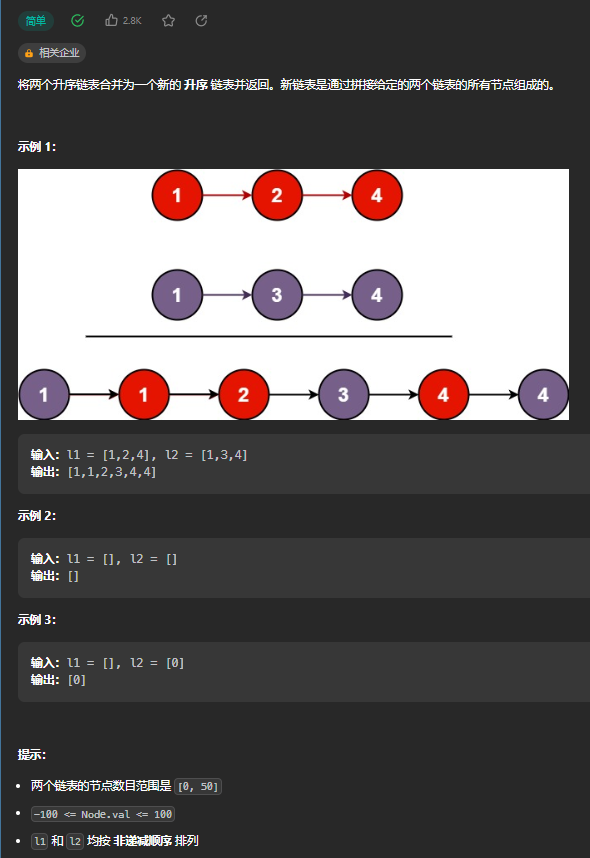
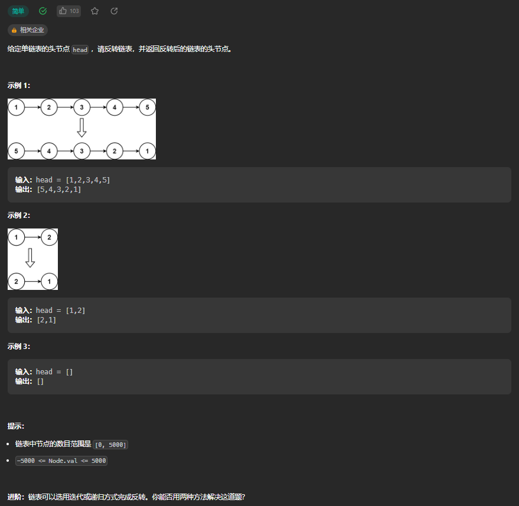
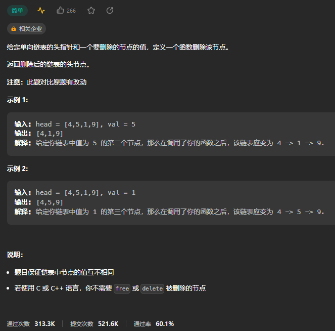
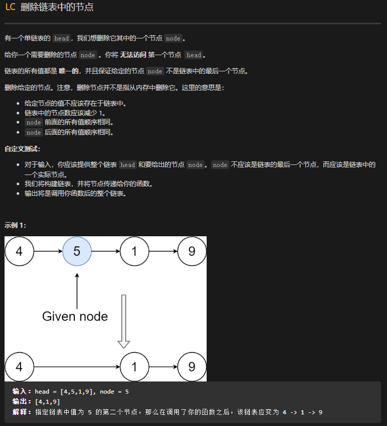
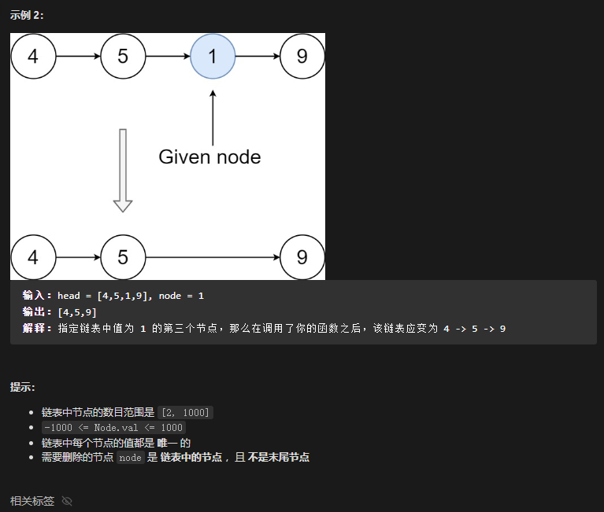
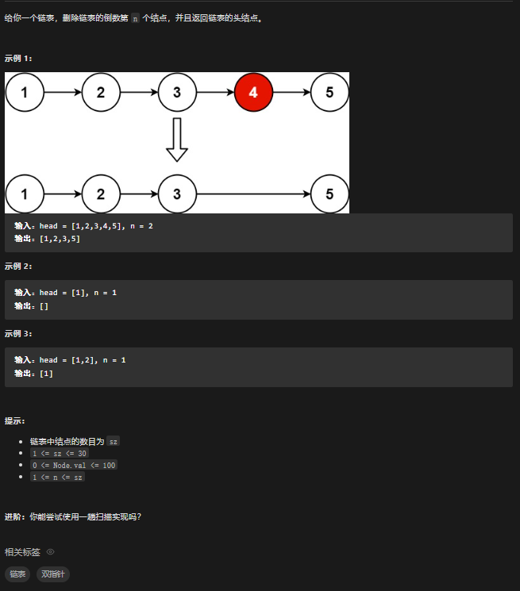
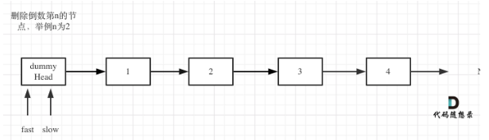
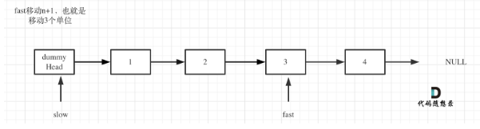
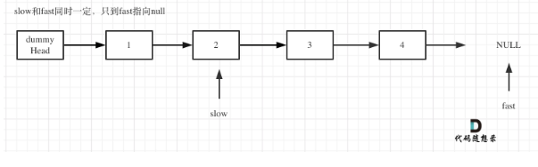

## [21. 合并两个有序链表](https://leetcode.cn/problems/merge-two-sorted-lists/)

### 思路

### 解法

#### 解法一：

~~~c
struct ListNode* mergeTwoLists(struct ListNode* list1, struct ListNode* list2){
     struct ListNode* list3 = (struct ListNode*)malloc(sizeof(struct ListNode));
    if(list1 == NULL) return list2;
    else if(list2 == NULL) return list1;
   
    struct ListNode* a3 = list3;
    while(list1 && list2){
        if(list1->val <= list2->val)
        {
            a3->next = list1;
            a3 = list1;
            list1 = list1->next;
            a3 -> next = NULL;
        }
        else{
            a3->next = list2;
            a3 = list2;
            list2 = list2->next;
            a3 -> next = NULL;
        }
    } 
    a3->next=list1?list1:list2;
    return list3->next;
}
~~~

## [剑指 Offer II 024. 反转链表]([剑指 Offer II 024. 反转链表 - 力扣（Leetcode）](https://leetcode.cn/problems/UHnkqh/))

### 思路

### 解法

#### 解法一：

~~~C
struct ListNode* reverseList(struct ListNode* head){
    struct ListNode* prev = NULL;
    struct ListNode* cur = head;
    struct ListNode* next;
    while(cur){
        next = cur->next;
        cur->next = prev;
        prev = cur;
        cur = next;
    }
    return prev;
}
~~~

## [剑指 Offer 18. 删除链表的节点]()

### 思路

### 解法

#### 解法一：双指针

~~~C
struct ListNode* deleteNode(struct ListNode* head, int val){
    if(head->val == val) {  // 头节点为待删除的节点
        return head->next;
    }
    
    struct ListNode* cur = head;  // 当前节点
    struct ListNode* pre = head;  // 保存待删除节点的前一节点
    while (cur != NULL && cur->val != val) {
        pre = cur;
        cur = cur->next;
    }
    if (cur != NULL) {
        pre->next = cur->next;
    }
    return head;
}
~~~

## [2. 两数相加]()

### 思路

### 解法

#### 解法一：

看见这道题我们很容易想到大数相加问题 当两个数大于长整型时需使用数组从后往前逐位向加,存储进位,进位取余10为该位值,除10位当前位的进位

通过大数相加原理和三目运算符得到该题最简写法 方法一：迭代 1.设置虚拟头结点:为防止内存泄露,虚拟头结点需删除

作者：Baal
链接：https://leetcode.cn/problems/add-two-numbers/solutions/19014/zui-jian-xie-fa-by-baal-3/

~~~C

struct ListNode* addTwoNumbers(struct ListNode* l1, struct ListNode* l2){
        struct ListNode* head = (struct ListNode*)malloc(sizeof(struct ListNode)),*cur=head,*del=head;
        //head虚拟头结点地址，cur当前节点地址，del用于删除虚拟头结点
        int t = 0;
        while(l1!=NULL || l2!=NULL || t)
        {
            cur->next=(struct ListNode*)malloc(sizeof(struct ListNode));
            cur=cur->next;
            if(l1!=NULL)
            {
                t += l1->val;
                l1=l1->next;
            }
            if(l2!=NULL)
            {
                t+=l2->val;
                l2=l2->next;
            }
            cur->val = t%10;
            t/=10;
        }
        cur->next=NULL;
        head=head->next;
        free(del);
        return head;
}
~~~

释放头结点而不是指针

~~~C
struct ListNode* addTwoNumbers(struct ListNode* l1, struct ListNode* l2){
    int c=0;
    struct ListNode *head=(struct ListNode *)malloc(sizeof(struct ListNode)),*cur=head,*del=head;
    //head虚拟头结点地址,cur当前节点地址,del用于删除虚拟头结点
    while(l1!=NULL||l2!=NULL||c)
    {
        cur->next=(struct ListNode *)malloc(sizeof(struct ListNode));
        cur=cur->next;
        l1=l1!=NULL?(c+=l1->val,l1->next):l1;
        l2=l2!=NULL?(c+=l2->val,l2->next):l2;
        cur->val=c%10;
        c=c/10;
    }
    cur->next=NULL;
    head=head->next;
    free(del);
    return head;
}
~~~

## 删除链表中的节点

目标：杀掉A

正常杀手需要找到A的把柄才可以杀掉A，
可现在找到A本人后竟然没有可以获取A把柄的途径
A得知我们要杀他，心生一计，可助你完成任务
A说我有B的把柄，你杀了B，我改头换面，以B的身份活着
GC也会自动清理掉B的尸体，没人会知道的
链接：https://leetcode.cn/leetbook/read/top-interview-questions-easy/xnarn7/?discussion=7wCHAG

~~~C
void deleteNode(struct ListNode* node) {
    node->val = node->next->val;
    node->next = node->next->next;
}
~~~

## 删除链表的倒数第N个节点

fast为什么要走n+1步，因为只有这样同事移动的时候slow才能指向删除节点的上一个节点，方便做删除操作。

~~~C
struct ListNode* removeNthFromEnd(struct ListNode* head, int n){
    //定义虚拟头结点dummy 并初始化使其指向head
    struct ListNode* dummy = malloc(sizeof(struct ListNode));
    dummy->val = 0;
    dummy->next = head;
    //定义fast slow指针
    struct ListNode* fast = head;
    struct ListNode* slow = dummy;

    for(int i=0;i<n;i++){
        fast = fast->next;//移动到第n+1个节点
    }

    while(fast){
        fast = fast->next;
        slow = slow->next;
    }

    slow->next = slow->next->next;//删除导数第n个节点
    head = dummy->next;
    free(dummy);//删除虚拟头结点dummy
    return head;
}
~~~

