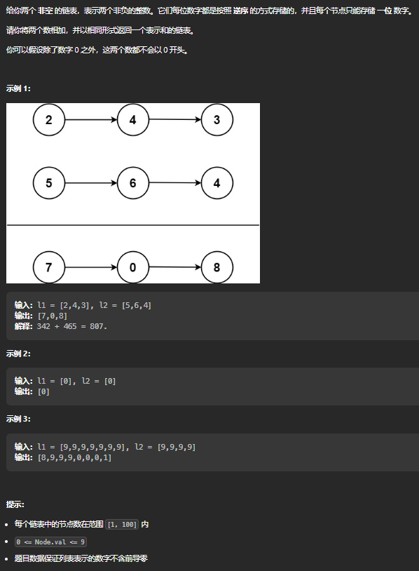

## [21. 合并两个有序链表](https://leetcode.cn/problems/merge-two-sorted-lists/)

### 思路

### 解法

#### 解法一：

~~~c
struct ListNode* mergeTwoLists(struct ListNode* list1, struct ListNode* list2){
     struct ListNode* list3 = (struct ListNode*)malloc(sizeof(struct ListNode));
    if(list1 == NULL) return list2;
    else if(list2 == NULL) return list1;
   
    struct ListNode* a3 = list3;
    while(list1 && list2){
        if(list1->val <= list2->val)
        {
            a3->next = list1;
            a3 = list1;
            list1 = list1->next;
            a3 -> next = NULL;
        }
        else{
            a3->next = list2;
            a3 = list2;
            list2 = list2->next;
            a3 -> next = NULL;
        }
    } 
    a3->next=list1?list1:list2;
    return list3->next;
}
~~~

## [剑指 Offer II 024. 反转链表]([剑指 Offer II 024. 反转链表 - 力扣（Leetcode）](https://leetcode.cn/problems/UHnkqh/))

### 思路

### 解法

#### 解法一：

~~~C
struct ListNode* reverseList(struct ListNode* head){
    struct ListNode* prev = NULL;
    struct ListNode* cur = head;
    struct ListNode* next;
    while(cur){
        next = cur->next;
        cur->next = prev;
        prev = cur;
        cur = next;
    }
    return prev;
}
~~~

## [剑指 Offer 18. 删除链表的节点]()

### 思路

### 解法

#### 解法一：双指针

~~~C
struct ListNode* deleteNode(struct ListNode* head, int val){
    if(head->val == val) {  // 头节点为待删除的节点
        return head->next;
    }
    
    struct ListNode* cur = head;  // 当前节点
    struct ListNode* pre = head;  // 保存待删除节点的前一节点
    while (cur != NULL && cur->val != val) {
        pre = cur;
        cur = cur->next;
    }
    if (cur != NULL) {
        pre->next = cur->next;
    }
    return head;
}
~~~

## [2. 两数相加]()

### 思路

### 解法

#### 解法一：

看见这道题我们很容易想到大数相加问题 当两个数大于长整型时需使用数组从后往前逐位向加,存储进位,进位取余10为该位值,除10位当前位的进位

通过大数相加原理和三目运算符得到该题最简写法 方法一：迭代 1.设置虚拟头结点:为防止内存泄露,虚拟头结点需删除

作者：Baal
链接：https://leetcode.cn/problems/add-two-numbers/solutions/19014/zui-jian-xie-fa-by-baal-3/

~~~C

struct ListNode* addTwoNumbers(struct ListNode* l1, struct ListNode* l2){
        struct ListNode* head = (struct ListNode*)malloc(sizeof(struct ListNode)),*cur=head,*del=head;
        //head虚拟头结点地址，cur当前节点地址，del用于删除虚拟头结点
        int t = 0;
        while(l1!=NULL || l2!=NULL || t)
        {
            cur->next=(struct ListNode*)malloc(sizeof(struct ListNode));
            cur=cur->next;
            if(l1!=NULL)
            {
                t += l1->val;
                l1=l1->next;
            }
            if(l2!=NULL)
            {
                t+=l2->val;
                l2=l2->next;
            }
            cur->val = t%10;
            t/=10;
        }
        cur->next=NULL;
        head=head->next;
        free(del);
        return head;
}
~~~

释放头结点而不是指针

~~~C
struct ListNode* addTwoNumbers(struct ListNode* l1, struct ListNode* l2){
    int c=0;
    struct ListNode *head=(struct ListNode *)malloc(sizeof(struct ListNode)),*cur=head,*del=head;
    //head虚拟头结点地址,cur当前节点地址,del用于删除虚拟头结点
    while(l1!=NULL||l2!=NULL||c)
    {
        cur->next=(struct ListNode *)malloc(sizeof(struct ListNode));
        cur=cur->next;
        l1=l1!=NULL?(c+=l1->val,l1->next):l1;
        l2=l2!=NULL?(c+=l2->val,l2->next):l2;
        cur->val=c%10;
        c=c/10;
    }
    cur->next=NULL;
    head=head->next;
    free(del);
    return head;
}
~~~

## 删除链表中的节点

目标：杀掉A

正常杀手需要找到A的把柄才可以杀掉A，
可现在找到A本人后竟然没有可以获取A把柄的途径
A得知我们要杀他，心生一计，可助你完成任务
A说我有B的把柄，你杀了B，我改头换面，以B的身份活着
GC也会自动清理掉B的尸体，没人会知道的
链接：https://leetcode.cn/leetbook/read/top-interview-questions-easy/xnarn7/?discussion=7wCHAG

~~~C
void deleteNode(struct ListNode* node) {
    node->val = node->next->val;
    node->next = node->next->next;
}
~~~

## 删除链表的倒数第N个节点

fast为什么要走n+1步，因为只有这样同事移动的时候slow才能指向删除节点的上一个节点，方便做删除操作。

~~~C
struct ListNode* removeNthFromEnd(struct ListNode* head, int n){
    //定义虚拟头结点dummy 并初始化使其指向head
    struct ListNode* dummy = malloc(sizeof(struct ListNode));
    dummy->val = 0;
    dummy->next = head;
    //定义fast slow指针
    struct ListNode* fast = head;
    struct ListNode* slow = dummy;

    for(int i=0;i<n;i++){
        fast = fast->next;//移动到第n+1个节点
    }

    while(fast){
        fast = fast->next;
        slow = slow->next;
    }

    slow->next = slow->next->next;//删除导数第n个节点
    head = dummy->next;
    free(dummy);//删除虚拟头结点dummy
    return head;
}
~~~

## [234. 回文链表](https://leetcode.cn/problems/palindrome-linked-list/description/)

方法一：将值复制到数组中后用双指针法

有两种常用列表示现。分为数组列表和链表。

- 数组列表底层是使用数组存储值，我们可以通过索引在 O(1)O(1)*O*(1) 的时间访问列表任何位置的值，这是由基于内存寻址的方式。
- 链表存储的是称为节点的对象，每个节点保存一个值和指向下一个节点的指针。访问某个特定索引的节点需要 O(n)O(n)O(n) 的时间，因为要通过指针获取到下一个位置的节点。

确定数组列表是否回文很简单，我们可以使用双指针法来比较两端的元素，并向中间移动。一个指针从起点向中间移动，另一个指针从终点向中间移动。这需要 O(n) 的时间，因为访问每个元素的时间是 O(1)，而有 n 个元素要访问。

然而同样的方法在链表上操作并不简单，因为不论是正向访问还是反向访问都不是 O(1)O(1)O(1)。而将链表的值复制到数组列表中是 O(n)，因此最简单的方法就是将链表的值复制到数组列表中，再使用双指针法判断。

**算法**

一共为两个步骤：

1. 复制链表值到数组列表中。
2. 使用双指针法判断是否为回文。

复杂度分析

时间复杂度：O(n)，其中 n 指的是链表的元素个数。
第一步： 遍历链表并将值复制到数组中，O(n)。
第二步：双指针判断是否为回文，执行了 O(n/2) 次的判断，即 O(n)。
总的时间复杂度：O(2n)=O(n)
空间复杂度：O(n)，其中 n 指的是链表的元素个数，我们使用了一个数组列表存放链表的元素值。

~~~C
bool isPalindrome(struct ListNode* head) {
    int vals[50001], vals_num = 0;
    while (head != NULL) {
        vals[vals_num++] = head->val;
        head = head->next;
    }
    for (int i = 0, j = vals_num - 1; i < j; ++i, --j) {
        if (vals[i] != vals[j]) {
            return false;
        }
    }
    return true;
}
~~~

**方法二：递归**

**思路**

递归为我们提供了一种优雅的方式来方向遍历节点。

~~~js
function print_values_in_reverse(ListNode head)
    if head is NOT null
        print_values_in_reverse(head.next)
        print head.val
~~~

为了想出使用空间复杂度为 O(1) 的算法，你可能想过使用递归来解决，但是这仍然需要 O(n) 的空间复杂度。

算法 currentNode 指针是先到尾节点，由于递归的特性再从后往前进行比较。frontPointer 是递归函数外的指针。若 currentNode.val != frontPointer.val 则返回 false。反之，frontPointer 向前移动并返回 true。

算法的正确性在于递归处理节点的顺序是相反的（回顾上面打印的算法），而我们在函数外又记录了一个变量，因此从本质上，我们同时在正向和逆向迭代匹配。

~~~C
struct ListNode* frontPointer;

bool recursivelyCheck(struct ListNode* currentNode) {
    if (currentNode != NULL) {
        if (!recursivelyCheck(currentNode->next)) {
            return false;
        }
        if (currentNode->val != frontPointer->val) {
            return false;
        }
        frontPointer = frontPointer->next;
    }
    return true;
}

bool isPalindrome(struct ListNode* head) {
    frontPointer = head;
    return recursivelyCheck(head);
}
~~~

栈

[141. 环形链表](https://leetcode.cn/problems/linked-list-cycle/)

**快慢指针**

本方法需要读者对「Floyd 判圈算法」（又称龟兔赛跑算法）有所了解。

假想「乌龟」和「兔子」在链表上移动，「兔子」跑得快，「乌龟」跑得慢。当「乌龟」和「兔子」从链表上的同一个节点开始移动时，如果该链表中没有环，那么「兔子」将一直处于「乌龟」的前方；如果该链表中有环，那么「兔子」会先于「乌龟」进入环，并且一直在环内移动。等到「乌龟」进入环时，由于「兔子」的速度快，它一定会在某个时刻与乌龟相遇，即套了「乌龟」若干圈。

我们可以根据上述思路来解决本题。具体地，我们定义两个指针，一快一慢。慢指针每次只移动一步，而快指针每次移动两步。初始时，慢指针在位置 head，而快指针在位置 head.next。这样一来，如果在移动的过程中，快指针反过来追上慢指针，就说明该链表为环形链表。否则快指针将到达链表尾部，该链表不为环形链表。

细节

为什么我们要规定初始时慢指针在位置 head，快指针在位置 head.next，而不是两个指针都在位置 head（即与「乌龟」和「兔子」中的叙述相同）？

- 观察下面的代码，我们使用的是 while 循环，**循环条件先于循环体**。由于循环条件一定是判断快慢指针是否重合，如果我们将两个指针初始都置于 head，那么 while 循环就不会执行。因此，我们可以假想一个在 head 之前的虚拟节点，慢指针从虚拟节点移动一步到达 head，快指针从虚拟节点移动两步到达 head.next，这样我们就可以使用 while 循环了。

- 当然，我们也可以使用 do-while 循环。此时，我们就可以把快慢指针的初始值都置为 head。

~~~C
bool hasCycle(struct ListNode *head) {
     if(head == NULL || head->next == NULL){
        return false;
    }
    struct ListNode* slow = head;
    struct ListNode* fast = head->next;
    while(slow != fast){
        if(fast == NULL || fast->next == NULL){
            return false;
        }
        slow = slow->next;
        fast = fast->next->next;
    }
    return true;
}
~~~

